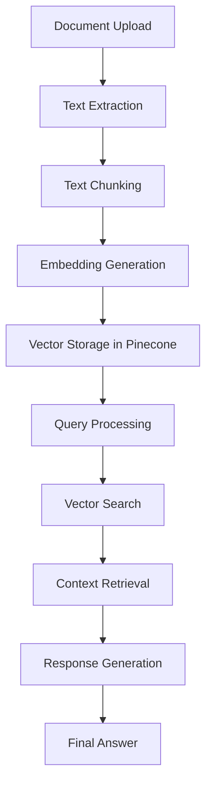

# RAGify Backend - RAG (Retrieval-Augmented Generation) Creator

## Overview

RAGify Backend is a powerful NestJS-based API that enables users to create, manage, and query Retrieval-Augmented Generation (RAG) systems. The system allows users to upload documents, chunk them into manageable pieces, generate embeddings, store them in a vector database, and retrieve relevant information to generate contextually accurate responses using Large Language Models.

## 🚀 Purpose

The RAGify Backend serves as the core engine for building RAG applications by providing:

- **Document Processing**: Upload and process various document types (PDF, CSV, plain text)
- **Intelligent Chunking**: Split documents into semantically meaningful chunks
- **Vector Embeddings**: Generate embeddings using OpenAI's embedding models
- **Vector Storage**: Store and manage embeddings in Pinecone vector database
- **Semantic Search**: Retrieve relevant documents based on user queries
- **AI-Powered Generation**: Generate responses using retrieved context and OpenAI's GPT models

## 🏗️ Architecture

The system follows a modular architecture with clear separation of concerns:

```
┌─────────────────┐    ┌─────────────────┐    ┌─────────────────┐
│   Frontend      │────│   NestJS API    │────│   External      │
│   (React)       │    │   (Backend)     │    │   Services      │
└─────────────────┘    └─────────────────┘    └─────────────────┘
                              │
                              ▼
                    ┌─────────────────┐
                    │   Data Storage  │
                    │   - Firestore   │
                    │   - Pinecone    │
                    └─────────────────┘
```

## 📋 Core Components

### 1. Controllers
- **ProjectController**: Manage RAG projects
- **TextController**: Handle document uploads and text processing
- **ChunkingController**: Process text chunking operations
- **EmbeddingController**: Manage embedding generation and storage
- **GenerationController**: Handle RAG query and response generation

### 2. Services
- **ProjectService**: Project management logic
- **ChunkingService**: Advanced text chunking algorithms
- **EmbeddingService**: OpenAI embedding integration
- **PineconeService**: Vector database operations
- **GenerationService**: LLM response generation
- **RetrievalService**: Semantic search and retrieval
- **FirestoreService**: Document storage and management
- **PdfService**: PDF document processing
- **CsvService**: CSV document processing

### 3. Data Transfer Objects (DTOs)
- **ProjectDto**: Project data structure
- **TextPayloadDto**: Text document payload
- **ChunkDto**: Text chunk representation
- **EmbeddingDto**: Embedding request/response
- **RetrievalDto**: Query and retrieval data
- **GenerationDto**: Generation request/response

## 🔧 Implementation Steps

### Step 1: Environment Setup

1. **Install Dependencies**
   ```bash
   npm install
   ```

2. **Configure Environment Variables**
   Create a `.env` file with the following variables:
   ```env
   # OpenAI Configuration
   OPENAI_API_KEY=your_openai_api_key_here

   # Firebase Configuration
   FIREBASE_PROJECT_ID=your_firebase_project_id
   FIREBASE_CLIENT_EMAIL=your_firebase_client_email
   FIREBASE_PRIVATE_KEY=your_firebase_private_key

   # Pinecone Configuration
   PINECONE_API_KEY=your_pinecone_api_key
   PINECONE_ENVIRONMENT=your_pinecone_environment
   PINECONE_INDEX_NAME=your_pinecone_index_name
   PINECONE_INDEX_HOST=your_pinecone_index_host

   # Server Configuration
   PORT=5000
   ```

### Step 2: Database Setup

1. **Firebase Firestore**
   - Create a Firebase project
   - Enable Firestore database
   - Generate service account credentials
   - Configure authentication

2. **Pinecone Vector Database**
   - Create a Pinecone account
   - Create a new index with 512 dimensions
   - Configure index settings for your use case

### Step 3: Project Initialization

1. **Create a Project**
   ```bash
   POST /projects
   {
     "user_id": "user123",
     "name": "My RAG Project"
   }
   ```

### Step 4: Document Processing Pipeline

1. **Upload Documents**
   ```bash
   # Upload PDF
   POST /text/upload-pdf
   # Upload CSV
   POST /text/upload-csv
   # Upload text directly
   POST /text
   ```

2. **Chunk Documents**
   ```bash
   POST /chunking/project/{projectId}
   {
     "chunkSize": 500,
     "chunkOverlap": 75,
     "chunkingStrategy": "semantic"
   }
   ```

3. **Generate Embeddings**
   ```bash
   POST /embedding/project/{projectId}
   {
     "modelName": "text-embedding-3-small"
   }
   ```

### Step 5: Query and Generation

1. **Query the RAG System**
   ```bash
   POST /generation/generate
   {
     "prompt": "What is the main topic discussed in the documents?",
     "projectId": "project123",
     "topK": 5
   }
   ```

## 🔄 RAG Pipeline Flow



### Detailed Pipeline Steps:

1. **Document Ingestion**
   - Upload documents via API endpoints
   - Extract text content from PDFs, CSVs, or direct text input
   - Store raw text in Firestore

2. **Text Chunking**
   - Apply intelligent chunking algorithms
   - Support multiple strategies: semantic, fixed, hybrid
   - Maintain chunk overlap for context preservation
   - Store chunks with metadata in Firestore

3. **Embedding Generation**
   - Generate vector embeddings using OpenAI's embedding models
   - Support configurable embedding dimensions (default: 512)
   - Batch process chunks for efficiency

4. **Vector Storage**
   - Store embeddings in Pinecone vector database
   - Include rich metadata for each vector
   - Support project-based organization

5. **Query Processing**
   - Accept natural language queries
   - Generate embeddings for user queries
   - Perform semantic similarity search

6. **Context Retrieval**
   - Retrieve top-k most relevant chunks
   - Rank results by similarity score
   - Prepare context for LLM

7. **Response Generation**
   - Combine retrieved context with user query
   - Generate responses using OpenAI's GPT models
   - Return contextually accurate answers

## 📚 API Endpoints

### Projects
- `POST /projects` - Create a new project
- `GET /projects/:id` - Get project by ID
- `GET /projects/user/:user_id` - Get projects by user
- `DELETE /projects/:id` - Delete project

### Text Processing
- `POST /text` - Create text document
- `POST /text/upload-pdf` - Upload PDF document
- `POST /text/upload-csv` - Upload CSV document
- `DELETE /text/:id` - Delete text document

### Chunking
- `POST /chunking/project/:projectId` - Chunk project documents

### Embeddings
- `POST /embedding/project/:projectId` - Generate embeddings for project

### Generation
- `POST /generation/generate` - Generate RAG response

## 🛠️ Key Features

### Advanced Text Chunking
- **Recursive Character Text Splitting**: Intelligent text segmentation
- **Multiple Strategies**: Semantic, fixed-size, and hybrid chunking
- **Configurable Parameters**: Adjustable chunk size and overlap
- **Context Preservation**: Maintains semantic boundaries

### Vector Database Integration
- **Pinecone Integration**: High-performance vector search
- **Metadata Support**: Rich metadata for each vector
- **Batch Operations**: Efficient bulk operations
- **Project Isolation**: Separate namespaces per project

### AI Model Integration
- **OpenAI Embeddings**: State-of-the-art text embeddings
- **GPT Integration**: Contextual response generation
- **Configurable Models**: Support for different model versions
- **Error Handling**: Robust error management

### Scalability Features
- **Batch Processing**: Handle large document collections
- **Async Operations**: Non-blocking processing
- **Resource Management**: Efficient memory and API usage
- **Monitoring**: Comprehensive logging and error tracking

## 🔒 Security Considerations

- **Input Validation**: Comprehensive request validation
- **Authentication**: Firebase-based user authentication
- **Data Isolation**: Project-based data separation
- **API Security**: CORS configuration and security headers
- **Error Handling**: Secure error messages without data leakage

## 🚀 Deployment

### Development
```bash
npm run start:dev
```

### Production
```bash
npm run build
npm run start:prod
```

### Docker (Recommended)
```bash
docker build -t ragify-backend .
docker run -p 5000:5000 ragify-backend
```

## 📊 Monitoring and Logging

The application includes comprehensive logging for:
- API requests and responses
- Processing pipeline steps
- Error tracking and debugging
- Performance metrics
- Database operations

## 🔧 Configuration

### Chunking Configuration
- **Default Chunk Size**: 500 characters
- **Default Overlap**: 15% of chunk size
- **Separators**: `['\n\n', '\n', ' ', '']`
- **Strategy**: Semantic (respects natural boundaries)

### Embedding Configuration
- **Default Model**: `text-embedding-3-small`
- **Default Dimensions**: 512
- **Batch Size**: 100 chunks per batch

### Generation Configuration
- **Default Model**: `gpt-3.5-turbo`
- **Context Window**: Optimized for retrieved chunks
- **Temperature**: Configurable for response creativity

## 🤝 Contributing

1. Fork the repository
2. Create a feature branch
3. Make your changes
4. Add tests for new functionality
5. Submit a pull request

## 📄 License

This project is licensed under the MIT License.

## 🆘 Support

For support and questions:
- Create an issue in the repository
- Check the documentation
- Review the API examples

---

**RAGify Backend** - Empowering developers to build intelligent, context-aware applications with Retrieval-Augmented Generation.